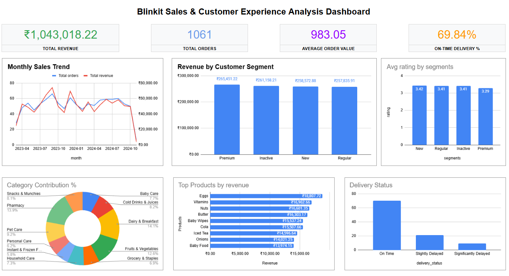

**SQL + Excel End-to-End Data Analytics Project**

**Project Overview**

This project analyzes Blinkit’s transactional data to uncover insights related to **sales performance**, **customer behavior**, **product trends**, and **delivery efficiency**.

The goal was to answer key business questions and provide actionable recommendations that can help improve revenue, customer satisfaction, and operational performance.

**Tools Used**

- **SQL** (MySQL / PostgreSQL / SQLite) – Data extraction, cleaning, joins, aggregations, and analysis
- **Microsoft Excel** – Data modeling, Pivot Tables, charts, and interactive dashboard

**Dataset**

The analysis is based on a multi-table Blinkit retail dataset containing:

- `blinkit_orders`
- `blinkit_order_items`
- `blinkit_products`
- `blinkit_customers`
- `blinkit_delivery_performance`
- `blinkit_customer_feedback`

**Key Business Questions Answered**
1. What is the overall sales performance (Revenue, Orders, AOV)?
2. How do sales trends look month-over-month?
3. Which customer segments contribute the most revenue?
4. What are the top-performing products and categories?
5. How is delivery performance (On-time vs Delayed)?
6. Is there a relationship between delayed deliveries and customer ratings?
7. What is the overall customer sentiment?

 **Dashboard Preview**

> *Add your actual dashboard screenshot here*

**Key Insights**
- Total Revenue generated: **₹10.43 Lakh**
- Total Orders: **1,061**
- Average Order Value (AOV): **₹983**
- Premium customers contribute significantly to revenue despite being a smaller segment
- **Dairy & Breakfast** and **Pharmacy** are among the top contributing categories
- Majority of orders are delivered **On Time**
- Delayed deliveries tend to have lower customer ratings
- Customer sentiment is largely positive

